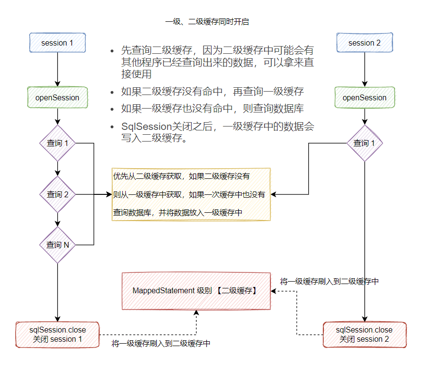

# MyBatisFramework
在手写的过程中学习 Mybatis 从解析、绑定、反射、缓存，到回话和事务操作，以及如何与 Spring 进行关联注册 Bean 对象，完成整合部分功能逻辑。

从设计结构上了解工厂模式对具体功能结构的封装，屏蔽过程细节，限定上下文关系，把对外的使用减少耦合。

使用 SqlSessionFactory 的工厂实现类包装了 SqlSession 的标准定义实现类，并由 SqlSession 完成对映射器对象的注册和使用。

重要知识点：映射器、代理类、注册机、接口标准、工厂模式、上下文。

------------------------------------------------------------------------------------------------------------------------

只有非常清楚的知道这个代理、封装、解析和返回结果的过程才能更好的完成整个框架的实现。

SqlSessionFactoryBuilder 的引入包装了整个执行过程，包括：XML 文件的解析、Configuration 配置类的处理，让 DefaultSqlSession 可以更加灵活的拿到对应的信息，获取 Mapper 和 SQL 语句。

工厂模式、建造者模式、代理模式的使用，这些技巧都可以让整个工程变得易于维护和易于迭代。

------------------------------------------------------------------------------------------------------------------------

整个 Mybatis 的操作都是使用 Configuration 配置项进行串联流程，所以所有内容都会在 Configuration 中进行链接。

以解析 XML 配置解析为入口，添加数据源的整合和包装，引出事务工厂对 JDBC 事务的处理，并加载到环境配置中进行使用。

通过数据源的引入就可以在 DefaultSqlSession 中从 Configuration 配置引入环境信息，把对应的 SQL 语句提交给 JDBC 进行处理并简单封装结果数据。

------------------------------------------------------------------------------------------------------------------------

连接池的实现重点包括：synchronized 加锁、创建连接、活跃数量控制、休眠等待时长，抛异常逻辑等

只有动手自己实现一遍数据源连接池才能更好的理解池化技术的落地方案，也能为以后做此类功能时，有一个可落地的具体方案。

------------------------------------------------------------------------------------------------------------------------

【策略+模板】
为什么要定义SQL执行器？
 - 解耦。
 - 抽象出一套标准，功能迭代中能方便的扩展

执行器贯穿始终（sqlSessionFactory.openSession(); 开始涉及到执行器）

执行器中又包括了对 JDBC 处理的拆解，链接、准备语句、封装参数、处理结果，所有的这些过程经过解耦后的类和方法，就都可以在以后的功能迭代中非常方便的完成扩展了。

------------------------------------------------------------------------------------------------------------------------

【对象工厂创建对象 + 反射工具包赋值】

使用了大量的 JDK 所提供的关于反射一些处理操作，也包括可以获取一个 Class 类中的属性、字段、方法的信息。那么再有了这些信息以后就可以按照功能流程进行解耦，把属性、反射、包装，都依次拆分出来，并按照设计原则，逐步包装让外接更少的知道内部的处理。

ObjectFactory：【对象工厂】Mybatis每次在创建Mapper映射结果对象实例的时候，就会使用ObjectFactory来完成对象实例。

如果通过继承DefaultObjectFactory类的方法来实现了自定义的ObjectFactory，那么就得使用Mybatis提供的标签来注册自定义的ObjectFactory。

```java
public class ExampleObjectFactory extends DefaultObjectFactory {}
```
```xml
<objectFactory type="org.mybatis.example.ExampleObjectFactory">
    <property name="someProperty" value="100"/>
</objectFactory>
```

当我们配置了相关的对象工程（objectFactory标签），则会调用我们自定义的对象工厂进行处理，相当于做了拦截。

【每次 MyBatis 创建结果对象的新实例时，它都会使用一个对象工厂（ObjectFactory）实例来完成实例化工作。 默认的对象工厂需要做的仅仅是实例化目标类，要么通过默认无参构造方法，要么通过存在的参数映射来调用带有参数的构造方法。 如果想覆盖对象工厂的默认行为，可以通过创建自己的对象工厂来实现】

MetaObject，Mybatis在sql参数设置和结果集映射里经常使用到这个对象。

构建元对象：MetaObject metaObject = configuration.newMetaObject(parameterObject);

拿到类的信息：属性、get/set 方法、构造器：（cn.forbearance.mybatis.refection.Reflector）

------------------------------------------------------------------------------------------------------------------------

通过设计原则进行拆分和解耦，运用不用的类来承担不同的职责，完成整个功能的实现。这包括：映射构建器、语句构建器、源码构建器的综合使用，以及对应的引用；脚本语言驱动和脚本构建器解析，处理我们的 XML 中的 SQL 语句。

------------------------------------------------------------------------------------------------------------------------

所包含的分包结构。比如：构建、绑定、映射、反射、执行、类型、事务、数据源等等

关于参数类型的策略化设计，通过策略解耦，模板定义流程，让我们整个参数设置变得更加清晰，也就不需要硬编码了

------------------------------------------------------------------------------------------------------------------------

围绕流程的解耦进行处理，过这样的方式来分配各个模块的单一职责，不让一个类的方法承担过多的交叉功能。

封装结果集源码：cn.bugstack.mybatis.executor.resultset.DefaultResultSetHandler#applyAutomaticMappings

------------------------------------------------------------------------------------------------------------------------

全部基础功能链路串联完毕。

【扩展点：Map类型映射、一级二级缓存、插件】

------------------------------------------------------------------------------------------------------------------------

resource、class 不能同时指向同一个文件
```xml
<mappers>
    <mapper resource="mapper/UserMapper.xml"/>
    <mapper class="cn.forbearance.mybatis.test.dao.IUserDao"/>
</mappers>
```
UserMapper.xml和cn.forbearance.mybatis.test.dao.IUserDao的namespace都指向IUserDao。

此时会抛异常：Type interface cn.forbearance.mybatis.test.dao.IUserDao is already known to the MapperRegistry.，重复加载接口

------------------------------------------------------------------------------------------------------------------------

一个ResultMap对应多个ResultMapping
```xml
<resultMap id="activityMap" type="cn.forbearance.mybatis.test.po.User">
  <id column="id" property="id"/>
  <result column="activity_id" property="activityId"/>
  <result column="activity_name" property="activityName"/>
  <result column="activity_desc" property="activityDesc"/>
  <result column="create_time" property="createTime"/>
  <result column="update_time" property="updateTime"/>
</resultMap>
```

ResultMapping会存到配置项中，Configuration伴随着整个session生命周期

------------------------------------------------------------------------------------------------------------------------

NoKeyGenerator 默认空实现不对主键单独处理

Jdbc3KeyGenerator 主要用于数据库的自增主键

SelectKeyGenerator 主要用于数据库不支持自增主键

SelectKeyGenerator：在一个数据库连接中，执行两条SQL，需要保证事务特性

不在同一个数据库连接下，也能执行，但是不能成功插入数据库，前后两个连接不一致，前一个sql无法commit，回滚了

------------------------------------------------------------------------------------------------------------------------

在解析动态节点时，多用策略模式进行替换 if else，最外层 -》第二层（trim）-》第三层（if） 会执行9次 SqlNode#apply，最外层嵌套 trim 节点，第二层嵌套 if 节点，【只包含test中sql时】

动态SQL节点会被封装成 MixedSqlNode，将 传入给 DynamicSqlSource ，MappedStatement#getSqlSource 时获取的就是 DynamicSqlSource；

会执行 MixedSqlNode#apply，进行 SQL 拼接

解析发生在XML解析阶段，而拼接发生在真正调用 select 阶段

````java
// cn.forbearance.mybatis.scripting.xmltags.XmlLanguageDriver.createSqlSource()

// cn.forbearance.mybatis.scripting.xmltags.XmlScriptBuilder.parseScriptNode()

MixedSqlNode rootSqlNode = new MixedSqlNode(contents);
SqlSource sqlSource;
if (isDynamic) {
    sqlSource = new DynamicSqlSource(configuration, rootSqlNode);
````

------------------------------------------------------------------------------------------------------------------------

插件流程


以 XML 解析为入口，解析用户自定义插件，提取拦截器接口实现类，保存到配置项的拦截器链对象中。接下来在创建语句处理器 StatementHandler 时，使用代理的方式构建实现类，并把拦截器作为对象中调用过程的一部分。

那么这个拦截器的调用是一种方法过滤判断的方式，通过拦截器实现类上配置的注解，提取要拦截的方法。当 Mybatis 框架执行到这些节点时，如调用 StatementHandler.prepare 方法时，则进行拦截器执行用户扩展的插件操作。

首先是以扩展 XMLConfigBuilder 解析自定义插件配置，将自定义插件写入配置项的拦截器链中。而每一个用户实现的拦截器接口都包装了插件的代理操作。这就像是一个代理器的盒子，把原有类的行为和自定义的插件行为，使用代理包装到一个调度方法中。

接下来是对自定义插件的激活部分，也就是把这个插件的调用挂在哪个节点下。那么这里通过在 Configuration 配置项在创建各类操作时候，把自定义插件嵌入进去。在本章节基于 StatementHandler 创建语句处理器时，使用拦截器链将定义插件包裹到 StatementHandler 目标方法中，这样在后续调用 StatementHandler 的方法时候，就顺便调用自定义实现的拦截器了。

在 newStatementHandler、newParameterHandler、newExecutor、newResultSetHandler 这四处执行 interceptorChain.pluginAll(handler);

```java
org.apache.ibatis.session.Configuration#newParameterHandler
org.apache.ibatis.session.Configuration#newResultSetHandler
org.apache.ibatis.session.Configuration#newStatementHandler
org.apache.ibatis.session.Configuration#newExecutor
```

通过代理对一个目标监听方法中，完成对扩展内容的调用。

1. Mybatis中插件的原理其实很简单，分为以下几步：
2. 在项目启动的时候判断组件是否有被拦截，如果没有直接返回原对象。
3. 如果有被拦截，返回动态代理的对象（Plugin）。
4. 执行到的组件的中的方法时，如果不是代理对象，直接执行原方法 如果是代理对象，执行Plugin的invoke()方法。

------------------------------------------------------------------------------------------------------------------------

在 Mybatis 的 XML 配置文件中，可以设置本地缓存的机制，如果不设置则是默认 SESSION 级别，也就是使用一级缓存保存会话生命周期内的数据。如果设置为 STATEMENT 则不使用一级缓存。

SqlSession 的工作主要交给 Executor 执行器完成，负责数据库的各种操作。当创建一个 SqlSession 对象时，Mybatis 会为这个 SqlSession 创建一个新的 Executor 执行器，而缓存的工具包也是在执行器的创建时构建出来的。

基于缓存的创建，在会话周期内保存查询结果数据，当一个 Session 会话内发生了改变数据的行为包括；insert/delete/update 则清空缓存。另外当主动执行 close、commit 和 clear 操作时，也要顺便把缓存数据清空。这样才能尽最大可能的提高查询效率的同时，降低发生脏读的可能。


所谓的 Session 级别，可以理解为数据库的一次连接内，只发生查询，除了第一次查询会查数据库外，之后的select都会从一级缓存中获取。

一级缓存属于轻量级缓存，仅限于在一次 Session 会话内完成，所以整个模型也可以简单的理解为使用 HashMap 存放缓存数据，当有发生对数据库的操作，则进行缓存清空。

通常如果说你的应用是独立的单体应用，或者并发体量较小的运营后台类应用，可能不会发生任何由于缓存所产生的脏读问题。但当你的应用是分布式部署，并且你的Session会话过长，执行了大范围的 select 操作，那么要注意此时数据的有效性。如果都是类似这样的场景，你可能需要关闭一级缓存，或者在关键节点及时手动清空缓存。

缓存的设计比较小巧，整个结构并不算复杂，但它的设计贯穿了整个 Session 的生命周期，这也提醒我们在设计一个业务流程的时，要考虑全局的流程状态流转，避免一小部分的问题影响全局的结果。另外关于 CacheKey 缓存 Key 的哈希设计也可以借鉴，如果你有大长字符串拼装需要作为 Key 使用的场景，可以参考类似这样的设计进行处理。

一级缓存在 List<User> u = userDao.queryUserById(user); query 方法执行时，先从缓存尝试获取

------------------------------------------------------------------------------------------------------------------------

那么关于缓存的实现，如果我们希望于当会话结束后，再发起的会话还是相同的查询操作，最好也是可以把数据从缓存中获取出来。这个时候该如何实现呢？其实这部分内容就是 Mybatis 框架中的二级缓存，以一个 Mapper 为生命周期，在这个 Mapper 内的同一个操作，无论发起几次会话都可以使用缓存来处理数据。

之所以这个操作称之为二级缓存，是因为它在一级缓存会话层上，添加的额外缓存操作，当会话发生 close、commit 操作时则把数据刷新到二级缓存中进行保存，直到执行器发生 update 操作时清空缓存。

三级缓存（自定义缓存）
org.apache.ibatis.builder.xml.XMLMapperBuilder#cacheElement() -> builderAssistant.useNewCache(typeClass, evictionClass, flushInterval, size, readWrite, blocking, props);

xml 和 select 标签中添加<cache type="org.mybatis.caches.redis.RedisCache"/> 指定type属性

将配置的第三方缓存设置到Configuration配置中，替换原生缓存

org.apache.ibatis.builder.MapperBuilderAssistant#useNewCache() -> currentCache = cache;

org.apache.ibatis.builder.MapperBuilderAssistant#addMappedStatement() -> 构建 MappedStatement 时，会将 currentCache 传入进行构建 MappedStatement，那么后期获取到的缓存就是从第三方缓存中获取，

即所谓的三级缓存，或者说自定义缓存（实现 org.apache.ibatis.cache.Cache 接口）

1. 一级缓存的作用域是一个sqlsession内；二级缓存作用域是针对mapper进行缓存；
2. 一级缓存是默认开启的；二级缓存需要手动配置
3. Mybatis 的一级缓存与二级缓存 只适用于单体项目，在分布式服务或者微服务架构下 都会出现数据不一致问题。三级缓存就是为了解决这个问题

二级缓存的执行流程




------------------------------------------------------------------------------------------------------------------------

MyBatis 整合 Spring

Spring refresh()

BeanDefinitionRegistryPostProcessor implement BeanFactoryPostProcessor

invokeBeanFactoryPostProcessors(beanFactory); 调用 BeanFactoryPostProcessor 各个实现类的 postProcessBeanFactory(factory) 方法

MyBatis 实现 BeanDefinitionRegistryPostProcessor 接口，重写 postProcessBeanDefinitionRegistry(factory) 方法，扫描指定路径，将扫描的 dao 接口，定义为 BeanDefinition 注册到 IOC 容器中

执行到 BeanFactoryPostProcessor 时，bean 注册完成，开始准备实例化

A:/usr/Software/maven-3.6.1/apache-maven-3.6.1/MAVEN_HOME/org/springframework/spring-context/5.2.10.RELEASE/spring-context-5.2.10.RELEASE-sources.jar!/org/springframework/context/support/PostProcessorRegistrationDelegate.java:119

上面给出的源代码行，【优先于 beanFactory.preInstantiateSingletons();】会先尝试优先实例化实现了 BeanDefinitionRegistryPostProcessor 接口的类的属性，就可以将 sqlSessionFactory 先于实例化出来了。

```xml
<bean class="foo.bar.xxx">
    <property name="referBeanName" ref="otherBeanName" />
</bean>
```
在Spring的解析段，其实容器中是没有依赖的Bean的实例的，那么这是这个被依赖的Bean如何在BeanDefinition中表示呢？答案就是RuntimeBeanReference.

在解析到依赖的Bean的时侯，解析器会依据依赖bean的name创建一个RuntimeBeanReference对像，将这个对像放入BeanDefinition的MutablePropertyValues中。
```java
//我们知道foo.bar.xxx 被解析为一个beanDefiniton，假设为xxxBeanDefinition
reference = new RuntimeBeanReference("otherBeanName");
xxxBeanDefinition.getPropertyValues().addPropertyValue("referBeanName", reference);
```
在创建Bean时，需要将依赖解析成真正的在Spring容器中存在的Bean。这是在getBean时由AbstractAutowireCapableBeanFactory在applyPropertyValues方法中通过BeanDefinitionValueResolver来实现的。BeanDefinitionValueResolver将真正的依赖bean和referBeanName关联起来。

mybatis 整合 spring 后使用 SqlSessionTemplate 作为 sqlSession 进行最外层的使用，并且使用内部类代理了 SqlSession 接口的方法，在内部类 SqlSessionInterceptor#invoke 方法中，实现 openSession() 和 closeSqlSession()

但 dao 接口还是使用 MapperProxy 进行代理的，只不过最外层调用的时候，sqlSession 属性是 SqlSessionTemplate 类型。

比如 selectList() 方法，会先执行到 SqlSessionInterceptor 代理对象的逻辑，然后开启 openSession 获取到 DefaultSqlSession，执行到真正的 DefaultSqlSession#selectList() 方法

```java
public class SqlSessionTemplate implements SqlSession, DisposableBean

this.sqlSessionProxy = (SqlSession) newProxyInstance(SqlSessionFactory.class.getClassLoader(), new Class[] { SqlSession.class }, new SqlSessionInterceptor());

SqlSession sqlSession = getSqlSession(SqlSessionTemplate.this.sqlSessionFactory, SqlSessionTemplate.this.executorType, SqlSessionTemplate.this.exceptionTranslator);
        session = sessionFactory.openSession(executorType);
```
MyBatis 框架源码的10种设计模式分析


### 建造型模式
#### 简单工厂模式
`cn.forbearance.mybatis.session.SqlSessionFactory`
```java
public interface SqlSessionFactory {
    SqlSession openSession();
}
```
`cn.forbearance.mybatis.session.defaults.DefaultSqlSessionFactory`
```java
public class DefaultSqlSessionFactory implements SqlSessionFactory {

    private final Configuration configuration;
    
    public DefaultSqlSessionFactory(Configuration configuration) {
        this.configuration = configuration;
    }
    
    @Override
    public SqlSession openSession() {
        Transaction tx = null;
        try {
            final Environment environment = configuration.getEnvironment();
            final TransactionFactory transactionFactory = environment.getTransactionFactory();
            tx = transactionFactory.newTransaction(environment.getDataSource(), TransactionIsolationLevel.READ_COMMITTED, false);
            // 创建执行器
            final Executor executor = configuration.newExecutor(tx);
            // 创建 DefaultSqlSession
            return new DefaultSqlSession(configuration, executor);
        } catch (Exception e) {
            try {
                assert tx != null;
                tx.close();
            } catch (SQLException ignore) {
            }
            throw new RuntimeException("Error opening session.  Cause: " + e);
        }
    }
}
```
- 简单工厂模式：简单工厂，是一种创建型设计模式，其在父类中提供一个创建对象的方法，允许子类决定实例对象的类型。

#### 单例模式
`cn.forbearance.mybatis.session.Configuration`

- 单例模式：是一种创建型模式，能够包装一个类只有一个实例，并提供一个访问该实例的全局节点。

Configuration 就像狗皮膏药一样大单例，贯穿整个会话的生命周期，所有的配置对象；映射、缓存、入参、出参、拦截器、注册机、对象工厂等，都在 Configuration 配置项中初始化。Configuration 会随着 SqlSessionFactoryBuilder 构建阶段完成实例化操作

#### 建造者模式
`cn.forbearance.mybatis.mapping.ResultMap`
```java
public class ResultMap {

    private String id;
    private Class<?> type;
    private List<ResultMapping> resultMappings;
    private Set<String> mappedColumns;

    public ResultMap() {
    }

    public static class Builder {
        private ResultMap resultMap = new ResultMap();

        public Builder(Configuration configuration, String id, Class<?> type, List<ResultMapping> resultMappings) {
            resultMap.id = id;
            resultMap.type = type;
            resultMap.resultMappings = resultMappings;
        }

        public ResultMap build() {
            resultMap.mappedColumns = new HashSet<>();
            for (ResultMapping mapping : resultMap.resultMappings) {
                final String column = mapping.getColumn();
                if (column != null) {
                    resultMap.mappedColumns.add(column.toUpperCase(Locale.ENGLISH));
                }
            }
            return resultMap;
        }
    }
}
```
- 建造者模式：属于创建型模式，使用多个简单的对象一步一步构建成一个复杂的对象，它提供了一种创建对象的最佳方式。
- 使用场景：关于 MyBatis 对建造者的使用，关于 XML 文件的解析以及各类对象的封装，都使用建造者以及建造者助手来完成对象的封装。它的核心目的就是不希望把过多的关于对象的属性设置，写到其他业务流程中，二十用建造者的方式提供最佳的边界隔离。
- 相似场景：`SqlSessionFactoryBuilder`、`XMLConfigBuilder`、`XMLMapperBuilder`、`XMLStatementBuilder`、`CacheBuilder`

### 结构型模式
#### 适配器模式
MyBatis 对适配器模式的应用：不同日志框架的适配


```java
// 适配器案例

// 旧接口
public interface OldApi {
    void oldApiMethod();
}

// 新接口
public interface NewApi {
    void newApiMethod();
}

/**
    适配器
    新系统需要使用 OldApi，但是 OldApi 接口的方法不符合新系统的需求，我们需要一个新的接口来适配 OldApi 接口。这时候就可以使用适配器模式
*/
public class OldApiAdapter implements NewApi {
    private OldApi oldApi;

    public OldApiAdapter(OldApi oldApi) {
        this.oldApi = oldApi;
    }

    @Override
    public void newApiMethod() {
        oldApi.oldApiMethod();
    }
}

// 调用适配器的 newApiMethod() 方法来访问 OldApi 接口中的 oldApiMethod() 方法。这样，我们就通过适配器模式实现了将 OldApi 接口适配到 NewApi 接口上，以满足新系统的需求。
public class Client {
    public static void main(String[] args) {
        OldApi oldApi = new OldApiImpl();
        NewApi newApi = new OldApiAdapter(oldApi);
        newApi.newApiMethod();
    }
}
```
- 适配器模式：是一种结构型设计模式，它能使接口不兼容的对象能够相互合作。

#### 代理模式
```java
public class MapperProxy<T> implements InvocationHandler, Serializable {

    private static final long serialVersionUID = 4434257806332045649L;
    
    /**
     * 可以理解为【接口名称+方法名称作为key】
     */
    private SqlSession sqlSession;
    
    private final Class<T> mapperInterface;
    
    private final Map<Method, MapperMethod> methodCache;
    
    public MapperProxy(SqlSession sqlSession, Class<T> mapperInterface, Map<Method, MapperMethod> methodCache) {
        this.sqlSession = sqlSession;
        this.mapperInterface = mapperInterface;
        this.methodCache = methodCache;
    }
    
    @Override
    public Object invoke(Object proxy, Method method, Object[] args) throws Throwable {
        if (Object.class.equals(method.getDeclaringClass())) {
            return method.invoke(this, args);
        } else {
            final MapperMethod mapperMethod = cachedMapperMethod(method);
            return mapperMethod.execute(sqlSession, args);
        }
    }
}
```


- 代理模式：是一种结构型秘书，能够提供对象的替代品或其占位符。代理控制着原对象的访问，并允许在将请求提交给原对象之前进行一些处理。
- 任何一个配置 DAO 接口所调用的 CRUD 方法，都会被 MapperProxy 接管，调用到方法执行器等一系列操作，并返回最终的数据库执行结果。

#### 组合模式
`cn.forbearance.mybatis.scripting.xmltags.SqlNode`
```java
public interface SqlNode {
    boolean apply(DynamicContext context);
}
```
`cn.forbearance.mybatis.scripting.xmltags.IfSqlNode`
```java
public class IfSqlNode implements SqlNode {

    private ExpressionEvaluator evaluator;
    private String test;
    private SqlNode contents;

    public IfSqlNode(SqlNode contents, String test) {
        this.test = test;
        this.contents = contents;
        this.evaluator = new ExpressionEvaluator();
    }

    @Override
    public boolean apply(DynamicContext context) {
        // 如果满足条件，则apply，
        if (evaluator.evaluateBoolean(test, context.getBindings())) {
            contents.apply(context);
            return true;
        }
        return false;
    }
}
```
`cn.forbearance.mybatis.scripting.xmltags.XmlScriptBuilder`

```java
public class XmlScriptBuilder extends BaseBuilder {
    private void initNodeHandlerMap() {
        // 9种，实现其中2种 trim/where/set/foreach/if/choose/when/otherwise/bind
        nodeHandlerMap.put("trim", new TrimHandler());
        nodeHandlerMap.put("if", new IfHandler());
    }

    List<SqlNode> parseDynamicTags(Element element) {
        List<SqlNode> contents = new ArrayList<>();
        List<Node> children = element.content();
        for (Node child : children) {
            if (child.getNodeType() == Node.TEXT_NODE || child.getNodeType() == Node.CDATA_SECTION_NODE) {
                String data = child.getText();
                TextSqlNode textSqlNode = new TextSqlNode(data);
                if (textSqlNode.isDynamic()) {
                    contents.add(textSqlNode);
                    this.isDynamic = true;
                } else {
                    contents.add(new StaticTextSqlNode(data));
                }
            } else if (child.getNodeType() == Node.ELEMENT_NODE) {
                String nodeName = child.getName();
                NodeHandler handler = nodeHandlerMap.get(nodeName);
                if (handler == null) {
                    throw new RuntimeException("Unknown element <" + nodeName + "> in SQL statement.");
                }
                handler.handleNode(element.element(child.getName()), contents);
                this.isDynamic = true;
            }
        }
        return contents;
    }
}
```


- 组合模式：是一种结构型设计模式。使用它可以将对象组合成树状结构，并且可以通过组合模式将多个不同类型的 SqlNode 组合在一起，以一种统一的方式对他们进行操作，而不需要关系它们的具体类型。
- 使用场景：主要体现在对各类 SQL 动态标签的解析上，以实现 SqlNode 接口的各个子类为主，而 SqlNode 接口的实现类就是每一个组合结构中的规则节点，通过规则节点的组装完成一颗规则树组合模式的使用。

```java
// 组合模式的使用案例

import java.util.ArrayList;
import java.util.List;

// 定义一个图形接口 Shape，它包含了渲染和缩放两个方法
interface Shape {
    void render();
    void resize(int factor);
}

// 定义具体的图形类，例如圆形、矩形和三角形
class Circle implements Shape {
    public void render() {
        System.out.println("Render a circle.");
    }
    public void resize(int factor) {
        System.out.println("Resize a circle by factor of " + factor + ".");
    }
}
class Rectangle implements Shape {
    public void render() {
        System.out.println("Render a rectangle.");
    }
    public void resize(int factor) {
        System.out.println("Resize a rectangle by factor of " + factor + ".");
    }
}
class Triangle implements Shape {
    public void render() {
        System.out.println("Render a triangle.");
    }
    public void resize(int factor) {
        System.out.println("Resize a triangle by factor of " + factor + ".");
    }
}

// 定义一个组合图形类 CompositeShape，它继承自 Shape，并且包含了一个 List<Shape>，用于存储子图形：
class CompositeShape implements Shape {
    private List<Shape> children = new ArrayList<>();

    public void add(Shape shape) {
        children.add(shape);
    }

    public void remove(Shape shape) {
        children.remove(shape);
    }

    public Shape getChild(int index) {
        return children.get(index);
    }

    public void render() {
        for (Shape child : children) {
            child.render();
        }
    }

    public void resize(int factor) {
        for (Shape child : children) {
            child.resize(factor);
        }
    }
}

public class CompositeDemo {
    public static void main(String[] args) {
        Shape circle1 = new Circle();
        Shape circle2 = new Circle();
        Shape rectangle = new Rectangle();
        Shape triangle = new Triangle();

        Shape composite = new CompositeShape();
        composite.add(circle1);
        composite.add(circle2);
        composite.add(rectangle);
        composite.add(triangle);

        composite.render(); // 渲染所有图形
        composite.resize(2); // 将所有图形放大两倍
    }
}
/*
输出结果为：

Render a circle.
Render a circle.
Render a rectangle.
Render a triangle.
Resize a circle by factor of 2.
Resize a circle by factor of 2.
Resize a rectangle by factor of 2.
Resize a triangle by factor of 2.
*/
```
由于组合图形中包含了不同类型的具体图形，因此我们可以通过组合模式以一种统一的方式对它们进行操作

#### 装饰器模式
`cn.forbearance.mybatis.session.Configuration`
```java
public Executor newExecutor(Transaction transaction) {
    Executor executor = new SimpleExecutor(this, transaction);
    if (cacheEnabled) {
        // 如果开启了二级缓存，创建 CachingExecutor （带有缓存的）
        executor = new CachingExecutor(executor);
    }
    return executor;
}
```


- 装饰器模式：是一种结构型设计模式，允许你通过将对象放入包含行为的特殊封装对象中，为原对象绑定新的行为。
- 场景介绍：MyBatis 的所有 SQL 操作，都是经过 SqlSession 会话调用 SimpleExecutor 简单执行器完成的。一级缓存的操作是在简单执行器中处理，而二级缓存是基于一级缓存刷新操作的。所以在实现上，通过创建一个缓存执行器，包装简单执行器的处理逻辑，实现二级缓存的操作，用到的就是装饰器模式。
- 主要体现在 Cache 缓存接口的实现和 CachingExecutor 执行器中。

### 行为型模式
#### 模板模式
`cn.forbearance.mybatis.executor.BaseExecutor`
```java
public <E> List<E> query(MappedStatement ms, Object parameter, RowBounds rowBounds, ResultHandler resultHandler, BoundSql boundSql, CacheKey key) throws SQLException {
    if (closed) {
        throw new RuntimeException("Executor was closed.");
    }
    // 清理局部缓存，查询堆栈为0则清理。queryStack 避免递归调用清理
    if (queryStack == 0 && ms.isFlushCacheRequired()) {
        clearLocalCache();
    }
    List<E> list;
    try {
        queryStack++;
        // 优先从缓存中获取数据
        list = resultHandler == null ? (List<E>) localCache.getObject(key) : null;
        if (list == null) {
            list = queryFromDatabase(ms, parameter, rowBounds, resultHandler, boundSql, key);
        }
    } finally {
        queryStack--;
    }
    if (queryStack == 0) {
        if (configuration.getLocalCacheScope() == LocalCacheScope.STATEMENT) {
            clearLocalCache();
        }
    }
    return list;
}
```
`cn.forbearance.mybatis.executor.SimpleExecutor`
```java
protected int doUpdate(MappedStatement ms, Object parameter) throws SQLException {
    Statement stmt = null;
    try {
        Configuration configuration = ms.getConfiguration();
        // 新建一个 StatementHandler
        StatementHandler handler = configuration.newStatementHandler(this, ms, parameter, RowBounds.DEFAULT, null, null);
        // 准备语句
        stmt = prepareStatement(handler);
        // StatementHandler.update
        return handler.update(stmt);
    } finally {
        closeStatement(stmt);
    }
}
```


- 模板模式：是一种行为设计模式，它在超类中定义了一个算法的框架，允许子类在不修改接哦古的情况下重写算法的特定步骤。
- 场景介绍：只要存在一些列可被标准定义的流程，且流程的大部分是通用的，只有一少部分是需要子类实现的，那么通常会采用模板模式来定义出这个标注的流程。像 MyBatis 的 BaseExecutor 就是一个用于定义模板模式的抽象类，在这个类中把查询、修改的操作都定义出了一套标准的流程。

#### 策略模式
`cn.forbearance.mybatis.type.TypeHandler`
```java
public interface TypeHandler<T> {

    /**
     * 设置参数
     *
     * @param ps
     * @param i
     * @param parameter
     * @param jdbcType
     * @throws SQLException
     */
    void setParameter(PreparedStatement ps, int i, T parameter, JdbcType jdbcType) throws SQLException;
    
    /**
     * 获取结构
     *
     * @param rs
     * @param columnName
     * @return
     * @throws SQLException
     */
    T getResult(ResultSet rs, String columnName) throws SQLException;
    
    /**
     * 获取结构
     *
     * @param rs
     * @param columnIndex
     * @return
     * @throws SQLException
     */
    T getResult(ResultSet rs, int columnIndex) throws SQLException;
}
```
`cn.forbearance.mybatis.type.LongTypeHandler`
```java
public class LongTypeHandler extends BaseTypeHandler<Long> {

    @Override
    protected void setNonNullParameter(PreparedStatement ps, int i, Long parameter, JdbcType jdbcType) throws SQLException {
        ps.setLong(i, parameter);
    }

    @Override
    protected Long getNullableResult(ResultSet rs, String columnName) throws SQLException {
        return rs.getLong(columnName);
    }

    @Override
    public Long getNullableResult(ResultSet rs, int columnIndex) throws SQLException {
        return rs.getLong(columnIndex);
    }
}
```


- 策略模式：是一种行为设计模式，它能定义一系列算法，并将每种算法分别放入独立的类中，以使算法的对象能够互相替换。
- 场景介绍：在 MyBatis 处理 JDBC 执行后返回的结果时，需要按照不同的类型获取对应的值，而使用策略模式就可以避免大量的if判断。所以这里基于 TypeHandler 接口对每个类型参数分别做了对应的策略实现。

#### 迭代器模式
在 `cn.forbearance.mybatis.refection.property.PropertyTokenizer` 用于解析对象关系的迭代操作

- 迭代器模式：是一种行为设计模式，它提供了一种访问聚合对象（如列表、树等）中各个元素的方法，而不需要暴露聚合对象的内部实现。能在不暴露集合底层表现形式的情况下遍历集合中所有的元素。


